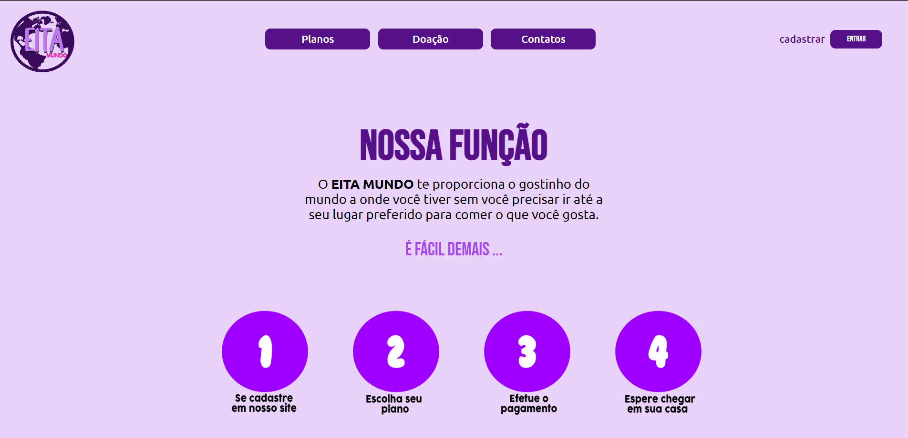

# EitaMundo
<h1 align="center">Eita Mundo</h1>

Projeto feito a partir de uma ideia pessoal para a venda de caixas com itens culturais. 

  <a href="#-tecnologias">Tecnologias</a>&nbsp;&nbsp;&nbsp;|&nbsp;&nbsp;&nbsp;
  <a href="#-projeto">Projeto</a>&nbsp;&nbsp;&nbsp;|&nbsp;&nbsp;&nbsp;
  <a href="#memo-licença">Licença</a>

  

 

 
    

## 🚀 Tecnologias

-Nesse projeto foi utilizado as seguintes tecnologias:

-CSS  
-HTML  
-JS  
-Figma  
-Github  

## 💻 Projeto

O projeto tem como objetivo principal a venda de caixas personalizadas e unicas com itens culturais de alguns países a fim de levar um pouco do mundo para as pessoas. .

- [Visite o projeto online](https://eita-mundo.vercel.app/)

Esse projeto está sob a licença MIT.

---

Feito com ♥ by Helena Lima

